# Data Flow

How data — especially sensitive data — moves through Shulker, with every redaction point marked.

```mermaid
flowchart LR
    USER(["Operator / Judge"]) -->|"target · contract · API key (form)"| WIZ["NewScan wizard (apps/web)"]

    WIZ -->|"POST /api/scan {auth:{apiKeyValue, bearerToken,…}}<br/>TLS to loopback backend"| SCANAPI["scan-api server.ts"]

    SCANAPI -->|"ScanConfig.authHeaders"| ENGINE["ScanEngine (scanner-core)"]
    ENGINE -->|"defaultHeaders on EVERY request"| SAFE["SafeHttpClient"]
    SAFE -->|"bounded requests w/ credentials"| TARGET["Target API<br/>(ShulkerLab :8700 or authorized external)"]
    TARGET -->|"responses"| SAFE

    SAFE -->|"raw exchange"| EVID["evidence.ts"]
    EVID -->|"REDACTION POINT #1<br/>JWT / sk- keys / auth headers /<br/>sensitive field names → [REDACTED]"| REDACT["shared/redact.ts"]
    REDACT -->|"redacted EvidenceRecord"| DB[("shulker.db<br/>sqlite")]

    ENGINE -->|"redacted ScanResult (no secrets by construction)"| DB
    DB -->|"GET /api/scan/:id (already redacted)"| PAGES["Findings · Evidence · Overview pages"]
    DB -->|"REDACTION GUARANTEED — input was redacted at capture"| REPORTS["reports.ts → HTML / MD / JSON"]
    ENGINE -->|"ScanEvent stream (messages only, never tokens)"| SSEHUB["SSE hub"]
    SSEHUB -->|"live events"| PAGES

    subgraph Verification["e2e assertion (scripts/e2e.mjs)"]
        GREP["grep every artifact — result, evidence,<br/>3 report formats, SSE transcript —<br/>original secret must appear NOWHERE"]
    end
    REPORTS -.-> GREP
    DB -.-> GREP

    style REDACT fill:#f0fdf4,stroke:#16a34a
    style DB fill:#f0f7fd,stroke:#0284c7
    style SAFE fill:#fffbeb,stroke:#d97706
```

## Sensitive-data inventory

| Data | Enters at | Where it's protected | Never appears in |
|---|---|---|---|
| Operator's API key / bearer token | New Scan form | Transported to engine, attached as `defaultHeaders` inside `SafeHttpClient` | Reports, SSE, sqlite, browser evidence views — all `[REDACTED]` at capture |
| Target's response bodies (may contain PII) | `SafeHttpClient` responses | Captured by `evidence.ts` → redacted (JWTs, keys, sensitive field names) | Unredacted persistence or display |
| Gemini API traffic | `ai.ts` (optional) | Receives sanitized endpoint metadata only — never credentials or evidence | Any storage |
| Scan results / findings | Engine → sqlite | Redacted by construction before persistence | — |

## Why one redaction point is enough

Redaction runs **at capture time inside the engine**, before anything leaves `scanner-core`. Downstream components (sqlite, SSE, reports, UI) receive only redacted data, so none of them can leak what they never had. The e2e suite proves this adversarially: it runs a scan with a known secret, then asserts that secret appears in **no** artifact — including the raw SSE transcript byte stream.
