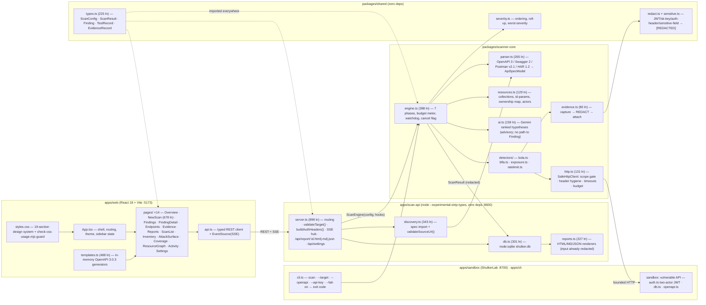

# Low-Level Architecture

Module-level view of the codebase: what each file does, what it may depend on, and the boundaries that make the safety guarantees enforceable.

## Dependency rules (enforced by convention + imports)

1. **`packages/shared` depends on nothing** and is imported by everything — safety primitives (types, severity, redaction) cannot be bypassed by a module "forgetting" to import them, and there is exactly one implementation.
2. **`packages/scanner-core` depends only on `shared`** (+ `yaml` for parsing). No server, no DOM, no Node-specific assumptions where avoidable — the same engine runs in the CLI and the server.
3. **Detectors never touch the network directly.** They receive the shared `SafeHttpClient`; the chokepoint is structural, not stylistic.
4. **The server never sees unredacted evidence.** `evidence.ts` redacts before records leave the engine; `db.ts` and `reports.ts` handle already-redacted data.
5. **Server runs TypeScript directly** via `node --experimental-strip-types` — no build step; only `apps/web` is bundled (Vite).

## Key interfaces

| Interface | Shape | Why it matters |
|---|---|---|
| `ScanConfig` | target, spec, auth mode/credentials, budget, probe counts, aiEnabled, allowExternal, confirmAuthorized | The single configuration surface; consent flags travel with the config |
| `EngineHooks.onEvent` | typed scan events | Fanned to SSE by the server, stderr by the CLI — one event source, many consumers |
| `TestRecord` | expected vs actual HTTP behavior | Required to construct a `Finding` — the no-hallucination guarantee |
| `EvidenceRecord` | redacted request/response pair | Attached to findings; what makes every report item replayable |
| `SafeHttpClient.request()` | single egress call | Increments budget, enforces scope, blocks Host/Content-Length injection, applies timeout |
